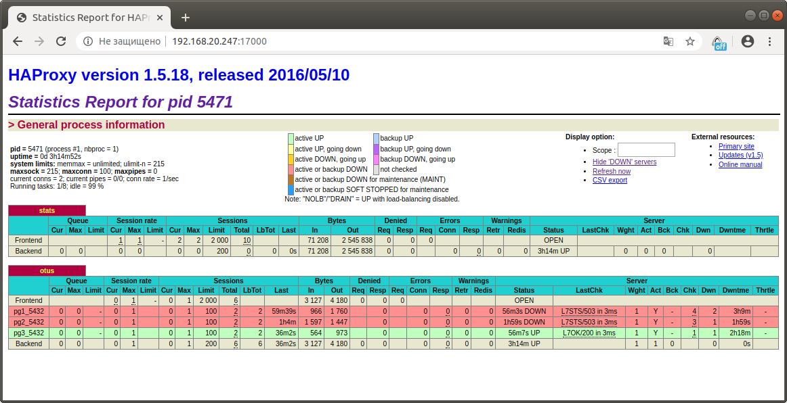

# Patroni

## Задание

Цель: 
- Развернуть кластер PostgreSQL из трех нод.
- Создать тестовую базу
- проверить статус репликации
- Сделать switchover/failover
- Поменять конфигурацию PostgreSQL + с параметром требующим перезагрузки
- Настроить клиентские подключения через HAProxy

## Выполнение
За основу взят стенд https://gitlab.com/otus_linux/patroni  

* Ubuntu заменена на CentOS7
* Добавлена машина pg3

**haproxy** (192.168.11.101) балансировщик, проверяющий доступность нод  
кластера HTTP запросами на порт 8008 сервиса patroni,  
позволяющий подключится к мастеру postgresql через порт TCP/5000,  
состояние можно увидеть на TCP/7000  
**pg** (192.168.11.120-122) ноды postgresql под управлением patroni  
**consul** (192.168.11.100) DSC для кластера  

Настройка стенда выполняется автоматически после запуска машины **haproxy**

## Проверка
### статус кластера
```bash
[root@centos7 linux-dz-28]# vagrant ssh pg2
Last login: Thu May 14 08:31:46 2020 from 192.168.11.1
[vagrant@pg2 ~]$ sudo -i
[root@pg2 ~]# /usr/local/bin/patronictl -c /etc/patroni/patroni.yml list
+ Cluster: otus (6826614757362752036) -------+----+-----------+
| Member |      Host      |  Role  |  State  | TL | Lag in MB |
+--------+----------------+--------+---------+----+-----------+
|  pg1   | 192.168.11.120 |        | running |  1 |         0 |
|  pg2   | 192.168.11.121 | Leader | running |  1 |           |
|  pg3   | 192.168.11.122 |        | running |  1 |         0 |
+--------+----------------+--------+---------+----+-----------+
```
Через веб-интерфейс haproxy 

зеленым подсвечен мастер, красным реплики
#### Проверка подключения через haproxy и репликации
подключаюсь к БД через haroxy и проверяю статус репликации
```bash
[root@pg2 ~]# su postgres
bash-4.2$ psql -h 192.168.11.101 -p 5000
could not change directory to "/root": Отказано в доступе
Password for user postgres: 
psql (11.7)
Type "help" for help.

postgres=# SELECT * FROM pg_stat_replication \gx
-[ RECORD 1 ]----+------------------------------
pid              | 6735
usesysid         | 16384
usename          | replicator
application_name | pg3
client_addr      | 192.168.11.122
client_hostname  | 
client_port      | 60322
backend_start    | 2020-05-14 08:32:05.092506+00
backend_xmin     | 
state            | streaming
sent_lsn         | 0/4000108
write_lsn        | 0/4000108
flush_lsn        | 0/4000108
replay_lsn       | 0/4000108
write_lag        | 
flush_lag        | 
replay_lag       | 
sync_priority    | 0
sync_state       | async
-[ RECORD 2 ]----+------------------------------
pid              | 6736
usesysid         | 16384
usename          | replicator
application_name | pg1
client_addr      | 192.168.11.120
client_hostname  | 
client_port      | 40472
backend_start    | 2020-05-14 08:32:05.488157+00
backend_xmin     | 
state            | streaming
sent_lsn         | 0/4000108
write_lsn        | 0/4000108
flush_lsn        | 0/4000108
replay_lsn       | 0/4000108
write_lag        | 
flush_lag        | 
replay_lag       | 
sync_priority    | 0
sync_state       | async
```
делаю новую бд pg2test
```bash
postgres=# create database pg2test;
CREATE DATABASE
```
проверяю что база появилась на реплике
```bash
[root@pg3 ~]# su postgres
bash-4.2$  psql -U postgres -h 192.168.11.122
could not change directory to "/root": Отказано в доступе
Password for user postgres: 
psql (11.7)
Type "help" for help.

postgres=# \l
                                  List of databases
   Name    |  Owner   | Encoding |   Collate   |    Ctype    |   Access privileges   
-----------+----------+----------+-------------+-------------+-----------------------
 pg2test   | postgres | UTF8     | en_US.UTF-8 | en_US.UTF-8 | 
 postgres  | postgres | UTF8     | en_US.UTF-8 | en_US.UTF-8 | 
 template0 | postgres | UTF8     | en_US.UTF-8 | en_US.UTF-8 | =c/postgres          +
           |          |          |             |             | postgres=CTc/postgres
 template1 | postgres | UTF8     | en_US.UTF-8 | en_US.UTF-8 | =c/postgres          +
           |          |          |             |             | postgres=CTc/postgres
(4 rows)
```

#### Проверка switchover

на текущем мастере pg2 остановлю сервис patroni
```bash
[root@pg2 ~]# systemctl stop patroni
```
на pg1 вижу что мастер сменился, pg1 теперь мастер
```bash
[root@pg1 ~]# /usr/local/bin/patronictl -c /etc/patroni/patroni.yml list
+ Cluster: otus (6826614757362752036) -------+----+-----------+
| Member |      Host      |  Role  |  State  | TL | Lag in MB |
+--------+----------------+--------+---------+----+-----------+
|  pg1   | 192.168.11.120 | Leader | running |  2 |           |
|  pg2   | 192.168.11.121 |        | stopped |    |   unknown |
|  pg3   | 192.168.11.122 |        | running |  1 |         0 |
+--------+----------------+--------+---------+----+-----------+
```
создаю БД pg1switchover
```bash
[root@pg1 ~]# su postgres
bash-4.2$ psql -h 192.168.11.101 -p 5000
could not change directory to "/root": Отказано в доступе
Password for user postgres: 
psql (11.7)
Type "help" for help.

postgres=# create database pg1switchover;
CREATE DATABASE
```

проверяю что база появилась на pg3 (клиент потерял соединение при переключении, но восстановил его)
```bash
postgres=# \l
FATAL:  terminating connection due to administrator command
сервер неожиданно закрыл соединение
	Скорее всего сервер прекратил работу из-за сбоя
	до или в процессе выполнения запроса.
The connection to the server was lost. Attempting reset: Succeeded.
postgres=# \l
                                    List of databases
     Name      |  Owner   | Encoding |   Collate   |    Ctype    |   Access privileges   
---------------+----------+----------+-------------+-------------+-----------------------
 pg1switchover | postgres | UTF8     | en_US.UTF-8 | en_US.UTF-8 | 
 pg2test       | postgres | UTF8     | en_US.UTF-8 | en_US.UTF-8 | 
 postgres      | postgres | UTF8     | en_US.UTF-8 | en_US.UTF-8 | 
 template0     | postgres | UTF8     | en_US.UTF-8 | en_US.UTF-8 | =c/postgres          +
               |          |          |             |             | postgres=CTc/postgres
 template1     | postgres | UTF8     | en_US.UTF-8 | en_US.UTF-8 | =c/postgres          +
               |          |          |             |             | postgres=CTc/postgres
(5 rows)
```

поднимаю pg2, 
```bash
[root@pg2 ~]# systemctl start patroni
```
проверяю наличие базы на pg2
```bash
[root@pg2 base]# su postgres
bash-4.2$ psql -h 192.168.11.121
Пароль пользователя postgres: 
psql (11.7)
Введите "help", чтобы получить справку.

postgres=# \l
                                    Список баз данных
      Имя      | Владелец | Кодировка | LC_COLLATE  |  LC_CTYPE   |     Права доступа     
---------------+----------+-----------+-------------+-------------+-----------------------
 pg1switchover | postgres | UTF8      | en_US.UTF-8 | en_US.UTF-8 | 
 pg2test       | postgres | UTF8      | en_US.UTF-8 | en_US.UTF-8 | 
 postgres      | postgres | UTF8      | en_US.UTF-8 | en_US.UTF-8 | 
 template0     | postgres | UTF8      | en_US.UTF-8 | en_US.UTF-8 | =c/postgres          +
               |          |           |             |             | postgres=CTc/postgres
 template1     | postgres | UTF8      | en_US.UTF-8 | en_US.UTF-8 | =c/postgres          +
               |          |           |             |             | postgres=CTc/postgres
(5 строк)
```
Проверяю состояние кластера
```bash
[root@pg3 ~]# /usr/local/bin/patronictl -c /etc/patroni/patroni.yml list
+ Cluster: otus (6826614757362752036) -------+----+-----------+
| Member |      Host      |  Role  |  State  | TL | Lag in MB |
+--------+----------------+--------+---------+----+-----------+
|  pg1   | 192.168.11.120 | Leader | running |  2 |           |
|  pg2   | 192.168.11.121 |        | running |  2 |         0 |
|  pg3   | 192.168.11.122 |        | running |  2 |         0 |
+--------+----------------+--------+---------+----+-----------+
```

#### Проверка failover
Сделаю мастером pg3
```bash
[root@pg3 ~]# /usr/local/bin/patronictl -c /etc/patroni/patroni.yml failover
Candidate ['pg2', 'pg3'] []: pg3
Current cluster topology
+ Cluster: otus (6826614757362752036) -------+----+-----------+
| Member |      Host      |  Role  |  State  | TL | Lag in MB |
+--------+----------------+--------+---------+----+-----------+
|  pg1   | 192.168.11.120 | Leader | running |  2 |           |
|  pg2   | 192.168.11.121 |        | running |  2 |         0 |
|  pg3   | 192.168.11.122 |        | running |  2 |         0 |
+--------+----------------+--------+---------+----+-----------+
Are you sure you want to failover cluster otus, demoting current master pg1? [y/N]: y
2020-05-14 10:50:44.26072 Successfully failed over to "pg3"
+ Cluster: otus (6826614757362752036) -------+----+-----------+
| Member |      Host      |  Role  |  State  | TL | Lag in MB |
+--------+----------------+--------+---------+----+-----------+
|  pg1   | 192.168.11.120 |        | stopped |    |   unknown |
|  pg2   | 192.168.11.121 |        | running |  2 |         0 |
|  pg3   | 192.168.11.122 | Leader | running |  2 |           |
+--------+----------------+--------+---------+----+-----------+
[root@pg3 ~]# /usr/local/bin/patronictl -c /etc/patroni/patroni.yml list
+ Cluster: otus (6826614757362752036) -------+----+-----------+
| Member |      Host      |  Role  |  State  | TL | Lag in MB |
+--------+----------------+--------+---------+----+-----------+
|  pg1   | 192.168.11.120 |        | stopped |    |   unknown |
|  pg2   | 192.168.11.121 |        | running |    |   unknown |
|  pg3   | 192.168.11.122 | Leader | running |  3 |           |
+--------+----------------+--------+---------+----+-----------+
[root@pg3 ~]# /usr/local/bin/patronictl -c /etc/patroni/patroni.yml list
+ Cluster: otus (6826614757362752036) -------+----+-----------+
| Member |      Host      |  Role  |  State  | TL | Lag in MB |
+--------+----------------+--------+---------+----+-----------+
|  pg1   | 192.168.11.120 |        | running |  3 |         0 |
|  pg2   | 192.168.11.121 |        | running |  3 |         0 |
|  pg3   | 192.168.11.122 | Leader | running |  3 |           |
+--------+----------------+--------+---------+----+-----------+
```
#### Изменение конфигурации с рестартом
сменю максимальное количество подключений для репликации

```bash
[root@pg1 ~]# /usr/local/bin/patronictl -c /etc/patroni/patroni.yml edit-config
--- 
+++ 
@@ -7,7 +7,7 @@
     archive_mode: 'on'
     max_connections: 100
     max_parallel_workers: 8
-    max_wal_senders: 5
+    max_wal_senders: 10
     max_wal_size: 2GB
     min_wal_size: 1GB
   use_pg_rewind: true

Apply these changes? [y/N]: y
Configuration changed
```
Последовательно сделаю рестарт серверов
```bash
[root@pg1 ~]# /usr/local/bin/patronictl -c /etc/patroni/patroni.yml restart otus pg3
+ Cluster: otus (6826614757362752036) -------+----+-----------+-----------------+
| Member |      Host      |  Role  |  State  | TL | Lag in MB | Pending restart |
+--------+----------------+--------+---------+----+-----------+-----------------+
|  pg1   | 192.168.11.120 |        | running |  3 |         0 |        *        |
|  pg2   | 192.168.11.121 |        | running |  3 |         0 |        *        |
|  pg3   | 192.168.11.122 | Leader | running |  3 |           |        *        |
+--------+----------------+--------+---------+----+-----------+-----------------+
When should the restart take place (e.g. 2020-05-14T11:56)  [now]: 
Are you sure you want to restart members pg3? [y/N]: y
Restart if the PostgreSQL version is less than provided (e.g. 9.5.2)  []: 
Success: restart on member pg3
[root@pg1 ~]# /usr/local/bin/patronictl -c /etc/patroni/patroni.yml list
+ Cluster: otus (6826614757362752036) -------+----+-----------+-----------------+
| Member |      Host      |  Role  |  State  | TL | Lag in MB | Pending restart |
+--------+----------------+--------+---------+----+-----------+-----------------+
|  pg1   | 192.168.11.120 |        | running |  3 |        16 |        *        |
|  pg2   | 192.168.11.121 |        | running |  3 |         0 |        *        |
|  pg3   | 192.168.11.122 | Leader | running |  3 |           |                 |
+--------+----------------+--------+---------+----+-----------+-----------------+
[root@pg1 ~]# /usr/local/bin/patronictl -c /etc/patroni/patroni.yml restart otus pg2
+ Cluster: otus (6826614757362752036) -------+----+-----------+-----------------+
| Member |      Host      |  Role  |  State  | TL | Lag in MB | Pending restart |
+--------+----------------+--------+---------+----+-----------+-----------------+
|  pg1   | 192.168.11.120 |        | running |  3 |         0 |        *        |
|  pg2   | 192.168.11.121 |        | running |  3 |         0 |        *        |
|  pg3   | 192.168.11.122 | Leader | running |  3 |           |                 |
+--------+----------------+--------+---------+----+-----------+-----------------+
When should the restart take place (e.g. 2020-05-14T11:57)  [now]: 
Are you sure you want to restart members pg2? [y/N]: y
Restart if the PostgreSQL version is less than provided (e.g. 9.5.2)  []: 
Success: restart on member pg2
[root@pg1 ~]# /usr/local/bin/patronictl -c /etc/patroni/patroni.yml restart otus pg1
+ Cluster: otus (6826614757362752036) -------+----+-----------+-----------------+
| Member |      Host      |  Role  |  State  | TL | Lag in MB | Pending restart |
+--------+----------------+--------+---------+----+-----------+-----------------+
|  pg1   | 192.168.11.120 |        | running |  3 |         0 |        *        |
|  pg2   | 192.168.11.121 |        | running |  3 |         0 |        *        |
|  pg3   | 192.168.11.122 | Leader | running |  3 |           |                 |
+--------+----------------+--------+---------+----+-----------+-----------------+
When should the restart take place (e.g. 2020-05-14T11:57)  [now]: 
Are you sure you want to restart members pg1? [y/N]: y
Restart if the PostgreSQL version is less than provided (e.g. 9.5.2)  []: 
Success: restart on member pg1
```
Статус кластера после перезапусков
```
[root@pg1 ~]# /usr/local/bin/patronictl -c /etc/patroni/patroni.yml list
+ Cluster: otus (6826614757362752036) -------+----+-----------+
| Member |      Host      |  Role  |  State  | TL | Lag in MB |
+--------+----------------+--------+---------+----+-----------+
|  pg1   | 192.168.11.120 |        | running |  3 |         0 |
|  pg2   | 192.168.11.121 |        | running |  3 |         0 |
|  pg3   | 192.168.11.122 | Leader | running |  3 |           |
+--------+----------------+--------+---------+----+-----------+
```
